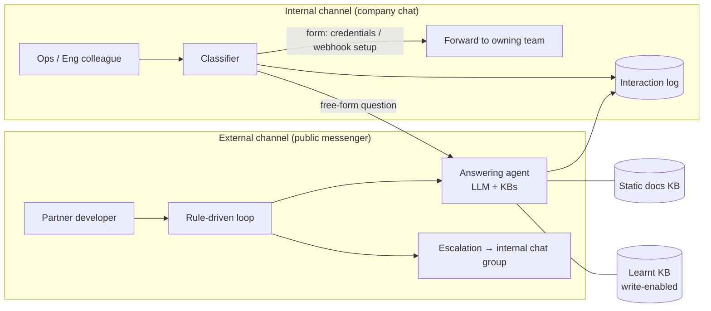

# Architecture

Two channels, one answering agent.



The answering agent is the only component that "thinks". Everything around it is
deterministic code so that control flow, timeouts and escalation never depend on the
model behaving.

---

## 1. The sentinel contract

The hardest part of wrapping an LLM in code is knowing *what kind* of reply it just
gave. We fixed this with a one-line protocol in the prompt:

> If you require more information, start your response with
> `[ADDITIONAL DETAILS REQUIRED]` and continue asking for the information.

The surrounding code then does:

```python
reply = invoke_agent(answering_agent, query=user_message)

if reply.startswith("[ADDITIONAL DETAILS REQUIRED]"):
    # relay the question, wait for the user, loop
else:
    # treat as an answer, send it, move to the satisfaction check
```

Why this works better than alternatives we tried:

- **It composes with structured output.** The agent is also held to a
  `{ "answer": string }` JSON schema so code never has to parse prose; the sentinel
  lives *inside* that string. A prefix the model must write as its first token is
  easier to enforce than a separate boolean field it must remember to set.
  <!-- TODO(Mika): 如果曾試過 needs_more_info 這類 boolean 欄位、效果如何，可以在這裡補一句 -->
- **It is human-readable.** The same prefix shows up in logs and in the internal
  channel, so a colleague scanning a thread sees instantly that the bot was blocked
  on missing details.
- **It doubles as a metric.** `more_information_required = reply.startswith(...)`
  is written straight to the log table, giving a per-turn count of how often
  partners had to be asked for more context.

The same idea is reused for *human* escalation: the escalation summary has a fixed
section list (Issue / Endpoint / Environment / Error / Request / Response /
Already tried / Likely cause / Missing info / Next action) so engineers get the same
shape every time.

## 2. The conversation loop

The external channel runs as one rule-driven agent per conversation. Pseudocode of
the real loop, with platform specifics removed:

```python
def main(chat_id):
    escalation_count = 0
    user_msg = ask(chat_id, "Please type in your question / error codes")
    if not user_msg:
        return timeout(chat_id)

    while True:
        reply = invoke_agent(ANSWERING_AGENT, query=user_msg)
        if not reply:
            return timeout(chat_id)

        if reply.startswith("[ADDITIONAL DETAILS REQUIRED]"):
            user_msg = ask(chat_id, reply)          # relay the agent's question
            if not user_msg:
                return timeout(chat_id)
            continue

        send(chat_id, reply)
        choice = ask_with_options(chat_id, "Does this answer your question?",
                                  ["Yes", "No"], timeout_minutes=2)

        if choice == "Yes":
            return "Answered"

        # "No", or anything else, counts as not solved
        if escalation_count >= 1:
            send(chat_id, "Your query has been escalated to the tech team ...")
            post_to_internal_group(build_escalation_summary(user_msg))
            return "Escalated"

        escalation_count += 1   # one more attempt before escalating
```

Design decisions worth copying:

- **The LLM never decides to escalate.** The user does (by answering "No" twice).
  An earlier prompt version let the agent escalate on its own judgement; moving the
  decision into the loop made escalation behaviour predictable.
- **Exactly one retry.** The second attempt re-runs the same question against the
  agent before escalating.
  <!-- TODO(Mika): 為什麼是 1 次而不是 2 次？如果有實際觀察（第二次答得更好/第三次沒差）補在這 -->

- **Every wait has a timeout** and a single, friendly recovery message that tells
  the user how to restart (`/help`). Silence is the most common failure mode on
  messenger bots.
- **Anything that isn't "Yes" is "No".** Free-text replies to a Yes/No prompt are
  treated as dissatisfaction, which errs on the side of a human looking at it.
- **Escalation goes to a group, not a person**, with an `@all`-style mention so
  nobody is a single point of failure.

## 3. Classifier → router (internal channel)

Internal colleagues ask the bot three kinds of things, and two of them are not
questions at all — they are *requests* that follow a fixed form:

```
Account Credentials
Environment: UAT/Live
Company Name: ...
Contact: ...
```

```
Webhook Configuration
Environment: UAT/Live
app-id: ...
Tracking Webhook: ...
Order Create Webhook: ...
```

A small, cheap classifier model sits at the entrance of the internal multi-agent
and routes:

| Class | Route | LLM involved? |
|-------|-------|---------------|
| Credential request | Rule-driven agent: post to the owning team's chat group, capture the thread id, log requester + timestamp | No |
| Webhook config request | Same as above | No |
| Free-form API question | Answering agent → reply in chat → log Q/A | Yes |

Lessons:

- **Give the form-shaped requests a form.** The classifier prompt spells out the
  exact field list for each request type, so a small model can match on shape
  rather than meaning.
  <!-- TODO(Mika): 表單格式是否有公告在 channel / onboarding guide？分類準確度有沒有量過？ -->
- **The classifier must be able to say what it can't do.** Its prompt includes a
  "when asked about your capabilities, list exactly these three" clause so it does
  not improvise a fourth.
- **Pass the original text through verbatim** to downstream agents — the prompt
  says "do not paraphrase or summarise", because the logging and forwarding steps
  need the exact fields (contact, app id) the requester typed.

## 4. Knowledge layering

The answering agent has two knowledge bases bound:

1. **Static docs KB** — the published API documentation and a PM-maintained FAQ /
   user guide. Read-only. Includes a single page of *allowed documentation links*.
2. **Learnt KB** — write-enabled. Resolved cases get saved here so the next
   occurrence is answered from precedent.

Prompt rules that keep this honest:

- "Only information from these two knowledge bases may be used."
- "Prioritise the learnt KB first."
- "Only links listed in the *API Documentation Links* page may be used. **Do not use
  any other links.**" — the single most effective anti-hallucination line. LLMs love
  inventing plausible doc URLs.
- "Do not invent request values, response values, endpoints, headers or error codes
  that were not provided. If a value is unknown, write `Unknown`."

The retrieval settings that worked: similarity search, top-k ≈ 5, a moderate score
threshold, and `read whole document` **off** (docs pages are long; chunks are
better).

See [lessons-learned.md](lessons-learned.md#the-insights-sheet-detour) for the
mistake of rebuilding the learnt KB as a spreadsheet.

## 5. Interaction logging

Every internal turn appends one row to a sheet:

```
requester | classification | question | question_ts |
bot_response | response_ts | thread_id | human_response | human_response_ts |
escalation_required | satisfactory | more_information_required | partner_app_id
```

Columns the bot can't fill (`human_response`, `satisfactory`) are left blank for
ops to complete later — the row is the ticket. Timestamps are written in the
business time zone, not UTC, because the people reading the sheet are not engineers.

What the table is designed to answer without any extra tooling:

- Volume by classification → which doc pages to improve.
- `more_information_required` rate → whether partners are supplying headers/body
  up front.
- Escalation rate → the bot's real coverage, as opposed to its self-reported one.

<!-- TODO(Mika): 如果實際有拿這張表做過分析（週報、改文件），補一個具體例子會更有說服力 -->

## Prompt-level guardrails (both channels)

Pulled out of the agent prompt because they apply to any support bot:

- **Tenant isolation**: never reveal another partner's identifiers or payloads, even
  in the escalation summary.
- **Language mirroring, code excepted**: answer in the user's language; never
  translate code blocks.
- **Hard length cap** (3,000 chars) — messenger platforms truncate silently.
- **Text only**: no images or files in replies, because the delivery tool can't
  send them and the model will otherwise "attach" a screenshot that never arrives.
- **Required diagnostics list** for any error report: error text, request headers
  (signature, timestamp, nonce, app id), request body, response body, and the
  signature-generation code if it is a signing issue. Asking for all five in one
  message avoids a round-trip per item.
  <!-- TODO(Mika): 有數字的話（平均來回次數 before/after）放這裡 -->

The full generalised prompt is in
[`prompts/support-agent.template.md`](../prompts/support-agent.template.md).
